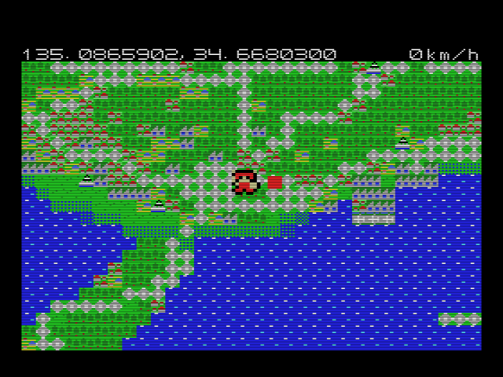
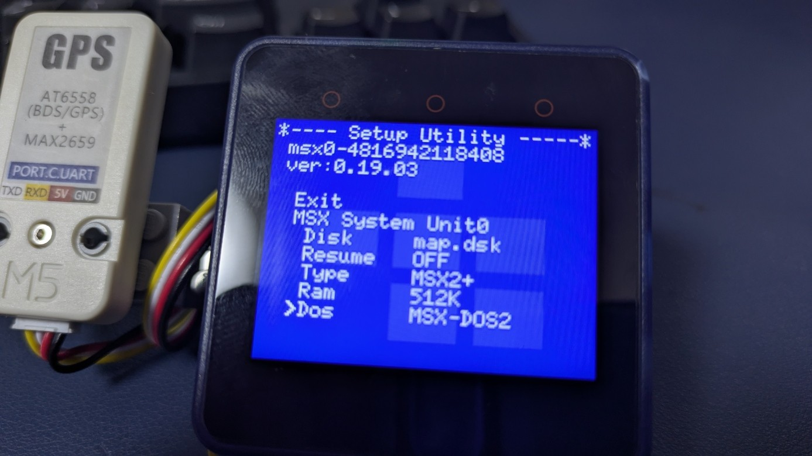
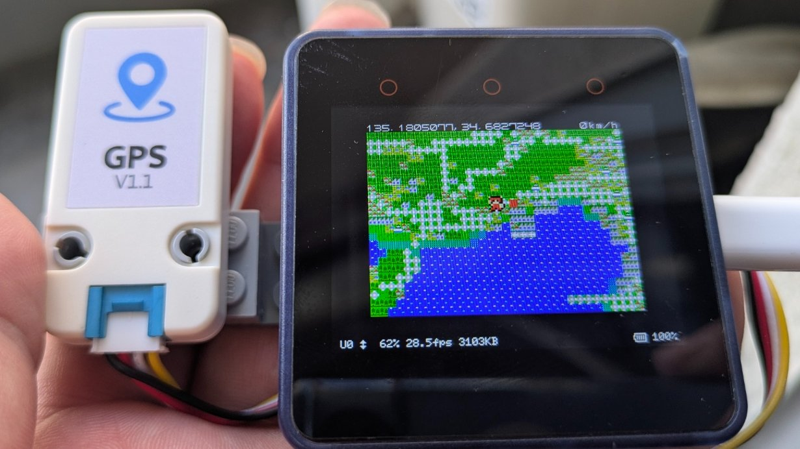
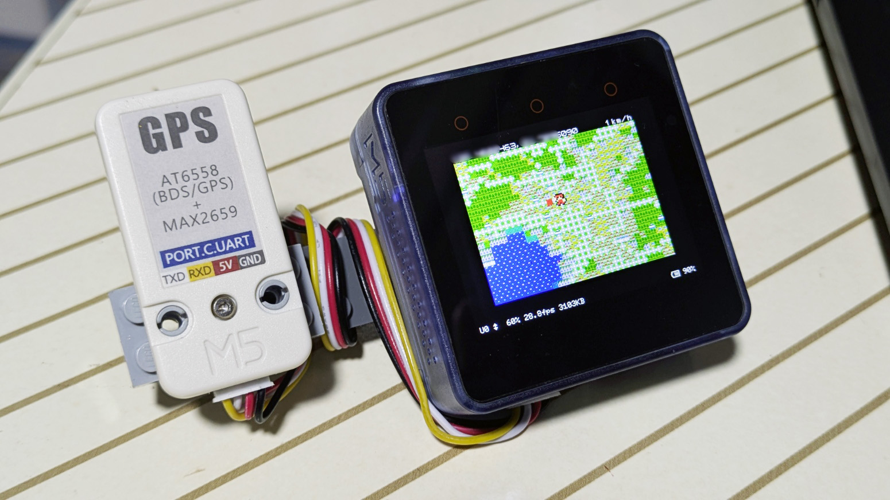
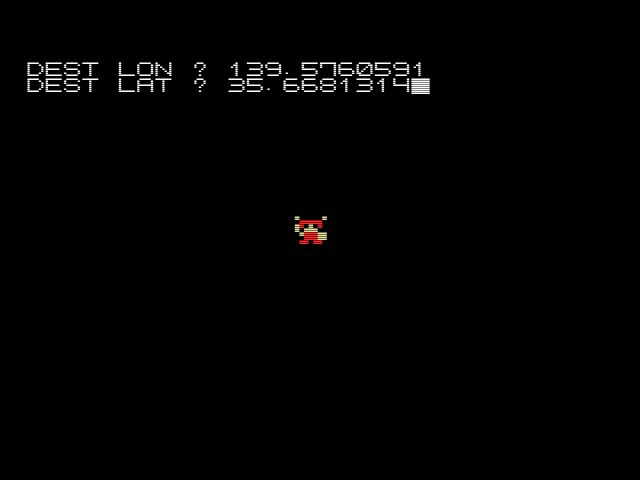

# MAP-VIEWER for MSX / MSX0

MSX / MSX0 で日本地図を表示する地図ビューアです。

MSX の SCREEN 1 上に、分割した地図データを必要に応じて読み込みながら表示します。通常版の `MAP.BAS` ではカーソル/ジョイスティック操作で地図を移動でき、MSX0 では `GPSMAP.BAS` を使うことで M5Stack 用 GPS ユニットから現在地を取得して表示できます。



## Features

- MSX / MSX0 上で日本地図を表示
- 地図データをタイル状の `.BIN` ファイルとして分割収録
- 現在位置の緯度・経度表示
- 目的地の緯度・経度入力と方向表示
- GPS から取得した位置情報による現在地表示
- MSX0 以外でも、MSX-DOS2 または Nextor が動作する環境で実行可能

## Files

| File / Directory | Description |
| --- | --- |
| `map.dsk` | 実行用ディスクイメージ |
| `src/MAP.BAS` | 通常版の地図ビューア |
| `src/GPSMAP.BAS` | MSX0 + GPS ユニット用の地図ビューア |
| `src/MAP.ASM` | 地図表示・座標計算などを行う機械語部分のソース |
| `src/PCG.pat`, `src/PCG.col` | 表示用 PCG データ |
| `src/Txx/*.BIN` | 分割された地図データ |

## Map Data Format

地図データは、MSX のメモリとディスクアクセスに合わせて小さなタイルに分割しています。

| Item | Value |
| --- | --- |
| 対象範囲 | 経度 123〜151 度、緯度 22〜46 度 |
| グリッド数 | 横 56 × 縦 48 |
| 1 タイルの範囲 | 経度 0.5 度 × 緯度 0.5 度 |
| 1 タイルの表示サイズ | 32 × 32 文字 |
| 1 タイルの実データサイズ | 512 bytes |
| ファイルサイズ | 519 bytes（BLOAD ヘッダ 7 bytes + 実データ 512 bytes） |
| ファイル名 | `src/Txx/Txx_yy.BIN` |

`xx` は西から東へのタイル番号、`yy` は北から南へのタイル番号です。たとえば `src/T35/T35_20.BIN` は、X=35、Y=20 の地図タイルを表します。

各タイルは 4 bit の値を 1 文字分の地図パターンとして持っています。1 byte に 2 文字分を格納し、1 行あたり 16 bytes、32 行で 512 bytes になります。表示時には 4 bit の値に `&H80` を加え、PCG の文字コードとして画面バッファへ展開します。

4 bit の値は、現在おおよそ次の意味で使っています。

| Value | Meaning |
| --- | --- |
| 0 | 海 |
| 1 | 陸 25% |
| 2 | 陸 50% |
| 3 | 陸 75% |
| 4 | 陸 |
| 5 | 市街地 |
| 6 | 林野 |
| 7 | 工場地 |
| 8 | 空港 |
| 9 | 高速道路 |
| 10 | 城 |
| 11 | 住宅地 / 低密度市街地 |
| 12〜15 | 予約 |

完全に海になるタイルはファイルを持たず、`MAP.ASM` 内の `SEA_TABLE` で判定して 0 で埋めたタイルとして扱います。そのため、`src` 配下には 56 × 48 個すべての `.BIN` があるわけではありません。

## Requirements

### MSX0 で実行する場合

- MSX0
- DOS 設定: MSX-DOS2 または Nextor
- GPS 連動表示: [M5Stack 用 GPS ユニット [U032]](https://www.switch-science.com/products/5694) または [M5Stack 用 GPS ユニット v1.1](https://www.switch-science.com/products/10037) を BOTTOM2 または Faces II の PORT C（水色）に接続

地図データは `T00`、`T01` のようなディレクトリに分けて格納しているため、ディレクトリに対応した DOS 環境が必要です。

このプロジェクトでは旧 GPS ユニット [U032] で動作確認しています。スイッチサイエンスでは販売終了となっています。

2026年5月時点の現行品である [M5Stack 用 GPS ユニット v1.1](https://www.switch-science.com/products/10037) でも、ボーレートを変更することで動作確認済みです。旧版 [U032] は UART 9600 bps、v1.1 は UART 115200 bps のため、`GPSMAP.BAS` の 7020 行目を次のように変更します。

```basic
7020 CALL COMINI("0:8N1NH",-1)
```

MSX0 の BASIC では、シリアルポートの速度指定 `-1` が 115200 bps に相当します。

### MSX0 以外で実行する場合

- MSX-DOS2 または Nextor が動作する MSX 環境
- ディスクイメージをマウントできるエミュレータ、または実機環境

## How to Run

### 通常版

1. `map.dsk` を MSX / MSX0 環境でマウントします。
2. BASIC から `MAP.BAS` を起動します。

```basic
RUN "MAP.BAS"
```

### GPS 版





1. `map.dsk` をマウントします。
2. BASIC から `GPSMAP.BAS` を起動します。

```basic
RUN "GPSMAP.BAS"
```

MSX0 で電源投入後に自動起動させたい場合は、起動したい BASIC ファイルを `AUTOEXEC.BAS` にリネームしてください。通常版を自動起動する場合は `MAP.BAS`、GPS 版を自動起動する場合は `GPSMAP.BAS` を `AUTOEXEC.BAS` にします。

## Controls

| Operation | Description |
| --- | --- |
| カーソル / ジョイスティック | 地図を移動 |
| `ESC` | 目的地の緯度・経度を入力 |

GPS 版では、GPS から取得した緯度・経度を使って現在地を更新します。

## Screenshots





## Notes

- 表示範囲は日本周辺を想定しています。
- 地図データは MSX で扱いやすいように分割・軽量化しています。
- GPS 版では NMEA の GGA センテンスを読み取り、緯度・経度へ変換しています。

## License

Source code and original files in this repository are released under CC0 1.0 Universal. See [LICENSE](LICENSE) for details.

Map data is derived from OpenStreetMap data.

The included map tile data under `src/Txx/*.BIN` and the map data contained in `map.dsk` are not released under CC0. They are derived from OpenStreetMap data and are subject to the Open Database License (ODbL).

© OpenStreetMap contributors  
OpenStreetMap data is available under the Open Database License (ODbL).  
https://www.openstreetmap.org/copyright

If you modify or redistribute the included map data, please follow the OpenStreetMap / ODbL attribution and share-alike requirements.
